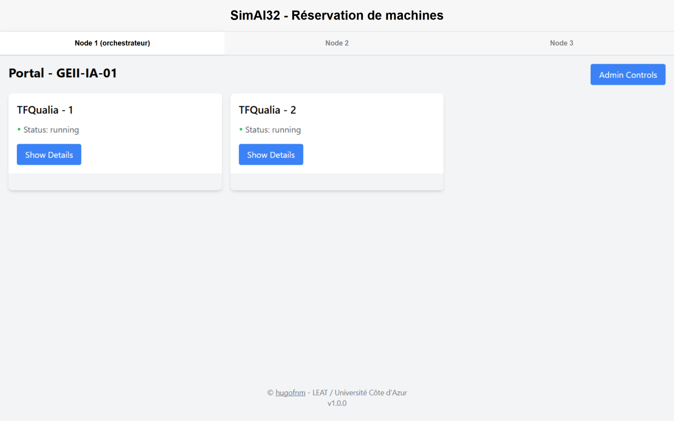
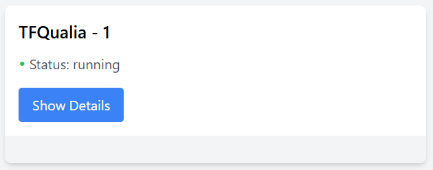
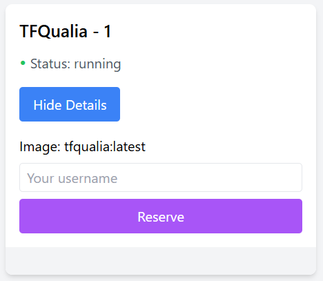

# Orchestration

L'orchestration dans un cluster GPU dédié à l'IA gère l'allocation des ressources, la répartition des tâches et l'exécution efficace des charges de travail. Des outils comme Docker Swarm optimisent l'utilisation des GPU, assurent la scalabilité et facilitent le déploiement des modèles d'IA distribués.

Ici, nous utilisons une solution maison basée sur la technologie de conteneurisation Docker&#x20;

## Réservation de machines

1.  Se connecter à l'adresse suivante : [http://clusteria](http://clusteria/) (il faut être connecté au [TailNet](connexion.md) du cluster avant !)&#x20;

    <figure><figcaption></figcaption></figure>
2.  Sélectionner **une des trois machines** disponibles (il est préférable de s’en rappeler afin d’éviter de prendre la place de quelqu’un d’autre)

    <figure><figcaption></figcaption></figure>
3.  Puis, sélectionner un conteneur (la puce verte signifie qu’il est disponible et qu’aucun étudiant ne travaille dessus)

    <figure><figcaption></figcaption></figure>
4.  Mettre son nom d’utilisateur universitaire et cliquer sur le bouton Reserve. Vous recevrez alors un mot de passe qui permet de s’authentifier en SSH. (N’oubliez pas que la machine a une durée de vie de 8 heures, après cela **TOUT ce qui n’a pas été placé dans le stockage persistant est supprimé**)

    <figure><figcaption></figcaption></figure>


Le stockage persistant est un volume de 10 GB monté sur chaque conteneur à travers les trois machines. Cela veut dire que tout le monde a accès en lecture et écriture à cet espace.


## Utilisations des machines


Chaque conteneur est assigné à un utilisateur. Étant donné que les machines sont connectées au réseau de l’Université, la charte informatique de celle-ci s’y applique.


Vous avez deux espaces de travail disponibles :&#x20;

* Soit l’interface web de Jupyter Lab, accessible en cliquant sur le bouton <kbd>Open on JupyterLab</kbd> ou à l’adresse <kbd>nomdelamachine:8888</kbd>, avec le mot de passe fourni lors de la réservation.&#x20;
* Ou bien par Visual Studio Code **(RECOMMANDÉ)**, en cliquant sur le bouton <kbd>Open on VSCode</kbd> ou :
  * Ouvrez VSCode.&#x20;
  * Cliquez sur <kbd>Se connecter à…</kbd> puis <kbd>Se connecter à l’hôte</kbd> et tapez <kbd>utilisateur@nomdelamachine</kbd> et le mot de passe.&#x20;


Voilà, vous êtes connectés sur la machine distante.&#x20;



Le dataset GTSRB est situé dans /dataset (lecture seule) et le stockage persistant dans /storage. Veuillez ne pas travailler sur le stockage persistant. (Python gère très mal les montages réseau)


## La machine

Veuillez ne rien installer dessus, même si vous n’avez pas les droits sudo :)&#x20;

Chaque conteneur vient équipé avec TOUTES les librairies nécessaires :&#x20;

* Python 3.11&#x20;
* Tensorflow 2.14&#x20;
* Keras&#x20;
* Torch, TorchVision, TorchAudio&#x20;
* Qualia, QualiaCodeGen&#x20;
* SciKit Learn, SciKit Image&#x20;
* OpenCV&#x20;
* Pandas, NumPy, MatPlotLib&#x20;
* Toutes les bibliothèques Nvidia (CUDA, CUDNN, …)&#x20;


Pour voir l’utilisation de votre GPU : `nvidia-smi`



Essayez d’être raisonnables en termes d’utilisation mémoire (batch sizes de 1M 😥😥😥, on n'est pas chez OpenAI)


Pour éviter d'être trop glouton sur la VRAM :

```python
gpus = tf.config.experimental.list_physical_devices('GPU')
if gpus:
  try:
    tf.config.experimental.set_virtual_device_configuration(gpus[0], [tf.config.experimental.VirtualDeviceConfiguration(memory_limit=2048)])
  except RuntimeError as e:
    print(e)
```

```python
// Si celle du haut ne marche pas ou pour TF1

from keras.backend.tensorflow_backend import set_session  
config = tf.ConfigProto()  
config.gpu_options.allow_growth = True  # dynamically grow the memory used on the GPU  
sess = tf.Session(config=config)  
set_session(sess)
```

