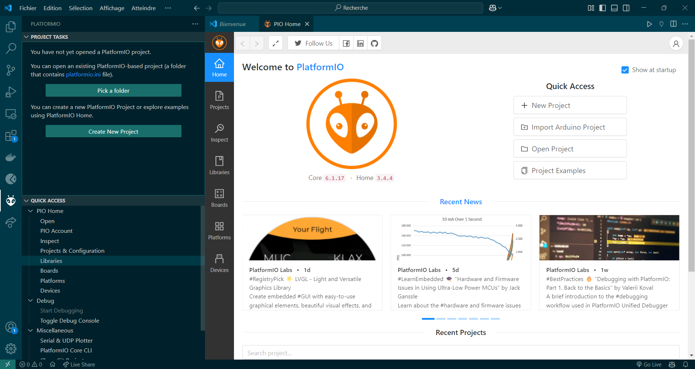
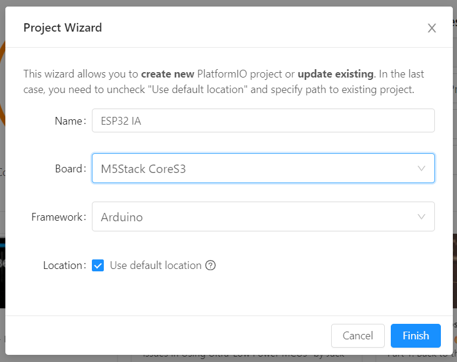
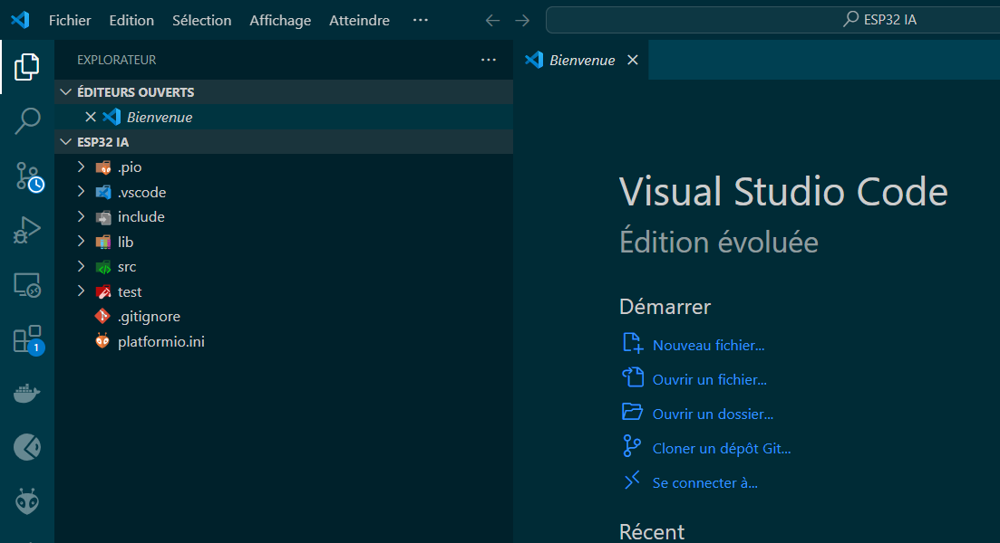
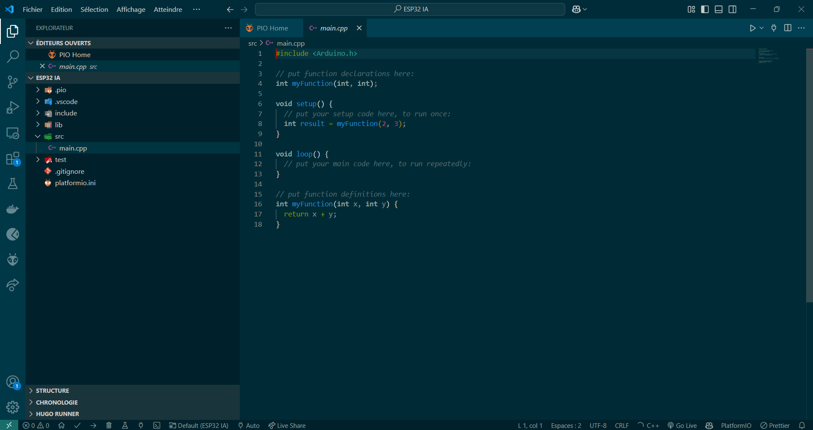
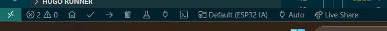

# IDE VSCode

## Introduction

Visual Studio Code (VSCode) est un éditeur de code léger, puissant et extensible, développé par Microsoft. Il prend en charge de nombreux langages, offre des fonctionnalités comme le débogage, l'auto-complétion et l'intégration Git.

## Installation



Une façon simple d'installer l'IDE VSCode est d'utiliser le gestionnaire de packages WinGet intégré à Windows. Pour ce faire, ouvrez une invite de commande en tant qu'administrateur et exécutez la commande suivante :

```shell
winget install -e --id Microsoft.VisualStudioCode
```



Méthode traditionnelle d'installation de l'IDE VSCode. Téléchargez le fichier d'installation depuis le site officiel de Microsoft et suivez les instructions d'installation.

[Télécharger Visual Studio Code](https://code.visualstudio.com/download)



## Configuration

Une fois l'IDE VSCode installé, il est nécessaire de configurer l'environnement de développement pour qu'il puisse reconnaître les cartes ESP32. Pour ce faire, ouvrez l'IDE VSCode et suivez les étapes suivantes :

1. Installez l'extension <kbd>PlatformIO</kbd> dans l'onglet <kbd>Extensions</kbd>
2.  Une fois téléchargée, cliquez sur l'icône <kbd>PlatformIO</kbd>, puis <kbd>PIO Home > Open</kbd>. Vous devriez voir ce menu :

    <figure><figcaption></figcaption></figure>
3.  Cliquez sur <kbd>New Project</kbd> et insérez ces paramètres (vous pouvez mettre d'importe quel nom) :

    <figure><figcaption></figcaption></figure>


Il est préférable de sauvegarder le projet sur votre disque Z:. Pour cela, décochez la case <kbd>Use default location</kbd> et sélectionnez un autre dossier.


✅ Voilà, l'IDE VSCode est maintenant configuré pour programmer des cartes ESP32. On peut maintenant passer à la suite...

## PlatformIO

Une fois votre projet créé, PlatformIO vous redirige automatiquement sur votre dossier.

<figure><figcaption></figcaption></figure>

De là, vous pouvez ouvrir le fichier <kbd>main.cpp</kbd> dans le dossier <kbd>/src</kbd>. C'est ici que vous allez pouvoir taper votre magnifique code.

<figure><figcaption><p>main.cpp</p></figcaption></figure>

## PlatformIO - Actions

<figure><figcaption></figcaption></figure>

Sur PlatformIO, vous avez tous les outils nécessaires à complier, flasher, debugger, serial monitorer (nouveau verbe), ...

* 🏠 : Retour sur PIO Home
* ✔️ : Compiler le programme
* ➡️ : Compiler et flasher le programme
* 🗑️ : Nettoyer les fichiers cache et build
* ⚗️ :  Test et debug
* 🔌 : Console série


Vérifiez que vous êtes sur le bon port série ! (Sélectionnez <kbd>🔌AUTO</kbd> pour modifier le port)

