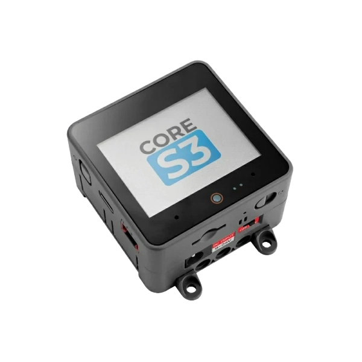

# Informations

## La cible

CoreS3 est la troisième génération de la série M5Stack Core. Alimenté par la solution ESP32-S3, ce kit comprend un processeur Xtensa LX7 dual-core fonctionnant à 240 MHz. Le CoreS3 est équipé d'une fonctionnalité Wi-Fi intégrée, permettant une connectivité transparente. Il dispose de 16 Mo de mémoire flash intégrée et de 8 Mo de PSRAM, offrant suffisamment d'espace pour le stockage des programmes.

<figure><figcaption>
Le M5Stack Core S3
</figcaption></figure>

## Informations supplémentaires

CoreS3 offre des options de programmation pratiques grâce à son interface USB TYPE-C. Cela permet une connexion facile avec des périphériques USB externes et un flashage du micrologiciel sans tracas.&#x20;

CoreS3 dispose d'un écran IPS tactile capacitif de 2,0 pouces. De plus, une caméra GC0308 est intégrée au bas de l'écran, accompagnée d'un capteur de proximité LTR-553ALS-WA.&#x20;

La gestion de l'alimentation est gérée par la puce centrale de gestion de l'alimentation AXP2101, qui utilise une boucle de contrôle du flux d'énergie à 4 voies pour une distribution efficace de l'énergie. La conception globale met l’accent sur une faible consommation d’énergie.&#x20;

CoreS3 dispose également d'un capteur d'attitude à 6 axes BMI270 et d'un magnétomètre BMM150 pour une détection précise des mouvements.&#x20;

Avec l'emplacement pour carte TF (microSD) intégré et la puce RTC BM8563, des fonctions de synchronisation et de réveil précises sont facilement disponibles.

La sortie sonore du CoreS3 est optimisée grâce à la puce d'amplificateur de puissance I2S 16 bits haute fidélité AW88298, accompagnée d'un haut-parleur 1 W intégré pour une lecture audio claire. Pour l'entrée sonore, le kit intègre la puce de décodage audio ES7210 et une entrée double microphone.&#x20;

Le côté de l'appareil comprend un bouton d'alimentation indépendant et un bouton de redémarrage (RST). En appuyant longuement sur le bouton de réinitialisation, les utilisateurs peuvent facilement accéder au mode de téléchargement du programme.&#x20;

Le kit CoreS3 est livré avec la base DinBase, offrant des options pratiques pour la fixation sur rail Din, au mur et par vis. Il peut être alimenté par une batterie externe DC 12 V (prend en charge 9 \~ 24 V) ou une batterie au lithium interne de 500 mAh.&#x20;

Le DinBase propose également plusieurs emplacements de proto permettant aux utilisateurs de personnaliser et d'étendre leurs projets. CoreS3 est un choix idéal pour le développement de l'IoT, le développement de divers projets de bricolage, les systèmes de contrôle de maison intelligente et les systèmes de contrôle d'automatisation industrielle.
