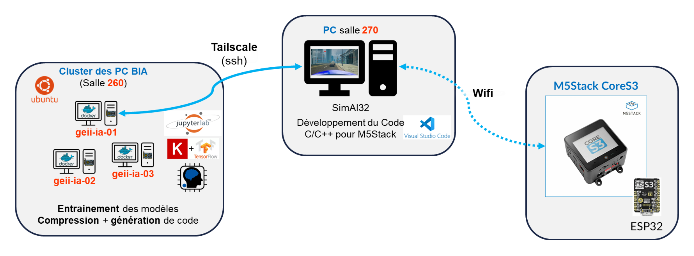

# Introduction

Le module d’Intelligence Artificielle Embarquée va vous permettre de découvrir les différentes technologies et outils nécessaires pour développer des applications d’IA sur des systèmes embarqués.&#x20;

Vous apprendrez à entraîner des modèles d’IA, à les déployer sur des microcontrôleurs et à les intégrer dans des applications embarquées.

## Schéma final

<figure><figcaption></figcaption></figure>

